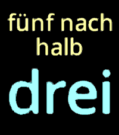

# SDF Fuzzy Text (v4.0)

A modern, high-performance fuzzy text watchface for the Pebble smartwatch platform (RebbleOS), featuring an ultra-crisp 4-bit Signed Distance Field (SDF) font engine, 2D affine matrix animation transformations, and multi-language support.

<p align="center">
  
</p>

---

## 📜 History & Attribution

This project began as a fork of [Sarastro72/Fuzzy-Text-Watch-Plus](https://github.com/Sarastro72/Fuzzy-Text-Watch-Plus) by Mattias Bäcklund (which itself was based on [PebbleTextWatch](https://github.com/wearewip/PebbleTextWatch) by wearewip).

**What changed in Version 4.0?**
Version 4.0 is a complete, ground-up rewrite in modern C++14:
- The legacy bitmap fonts, multiple duplicated language files, and fixed TextLayer slide animations have been completely replaced.
- Replaced by a custom **Signed Distance Field (SDF)** rasterizer, an analytical Bézier font generator, 2D affine matrix transformations, and a unified multilingual fuzzy time engine.
- Uses subpixel text anti-aliasing and arbitrary smooth scaling.
---

## ✨ Features

- **4-bit Signed Distance Field (SDF) Font Rendering**:
  - Subpixel anti-aliasing rendered smoothly at arbitrary font sizes and positions.
  - High glyph compactness: only ~8.4 KB packed font data for all required letters, digits, and localized accents.
  - Analytical Cardano cubic Bézier distance solving at build time (`ttf2sdf.py`).
  - Zero font binaries checked into git; generated directly from system fonts during build.
- **Fluid 2D Matrix Animations**:
  - Full 2D affine transformations (smooth translation, rotation, and scaling) during minute transitions.
  - Configurable animation duration (from instant transitions to cinematic slides).
- **Comprehensive Multi-Language Engine**:
  - Supports 8 languages/dialects:
    - German Western (*"zehn nach halb drei"*)
    - German Eastern (*"dreiviertel drei"*)
    - English (*"quarter to nine"*)
    - Spanish (*"nueve menos cuarto"*)
    - Dutch (*"kwart voor negen"*)
    - Italian (*"nove meno un quarto"*)
    - Norwegian (*"fem på halv tre"*)
    - Swedish (*"kvart i nio"*)
  - Context-aware automatic line wrapping, hyphenation, and dynamic vertical centering (1 to 3 lines).
- **Interactive Gestures & Alerts**:
  - **Date Display**: Wrist flick or shake gesture reveals exact digital time, weekday, and date.
  - **Bluetooth Alert**: Optional buzz and localized alert message when phone disconnects (*"Wo ist dein Handy?"*, *"Where is your phone?"*).
- **Modern Web Configuration**:
  - Hosted settings page with live color pickers, language selection, time offset, and persistent storage.
- **Target Platform**:
  - Optimized for **Pebble Time 2 (`emery`)** with its high-resolution color display and Cortex-M33 architecture.

---

## 🛠️ Building & Installation

### Requirements
- Pebble SDK (SDK 4.33+ with Rebble support)
- GNU ARM Embedded Toolchain (`arm-none-eabi-g++` with C++14 support)
- Python 3 with `venv` support

### Build with `build.sh`
The repository includes a self-contained build script that sets up an isolated Python virtual environment, installs `fonttools`, generates the SDF font tables, and compiles the watchface:

```bash
./build.sh
```

### Install on Emulator
To test the watchface on the Pebble Time 2 emulator:

```bash
pebble install --emulator emery
```

### Configuration
Open the configuration page in your browser or through the Pebble mobile app:

```bash
pebble emu-app-config --emulator emery
```

---

## 📐 Architecture Overview

```
SDF-Fuzzy-Text/
├── SDFLib/
│   ├── ttf2sdf.py         # Analytical Cardano cubic Bézier SDF generator
│   ├── sdf_config.ini     # Font parameters & character subset definition
│   ├── Matrix2D.hpp       # 2D Affine Transformation Matrix
│   ├── SdfRenderer.hpp/cpp# Fast 4-bit SDF rasterizer & alpha blender
│   └── TextLayout.hpp/cpp # Dynamic multi-line text layout & hyphenation
├── src/
│   ├── FuzzyTime.hpp/cpp  # Unified multilingual fuzzy phrasing
│   ├── TextWatch.h/cpp    # Main Pebble watchface lifecycle & animations
│   └── js/pebble-js-app.js# Clay/Webview configuration interface
├── config/
│   └── index.html         # Modern HTML5 responsive configuration page
├── build.sh               # One-click automated setup & build script
└── wscript                # Waf build script with arm-none-eabi-g++ C++14 support
```

---

## 📄 License

- Licensed under **GPLv3** (consistent with the original project).
- Original concept by **Mattias Bäcklund** & **wearewip**.
- Version 4.0 SDF engine and C++ rewrite by **Uli Tessel** (2026).
